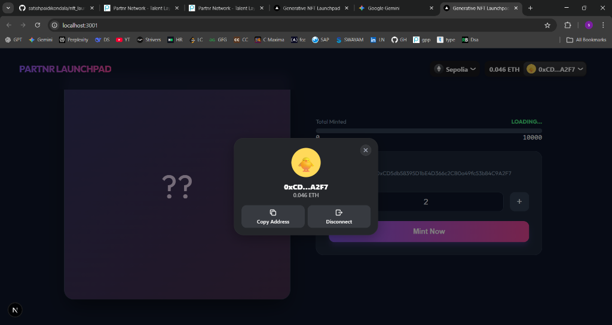
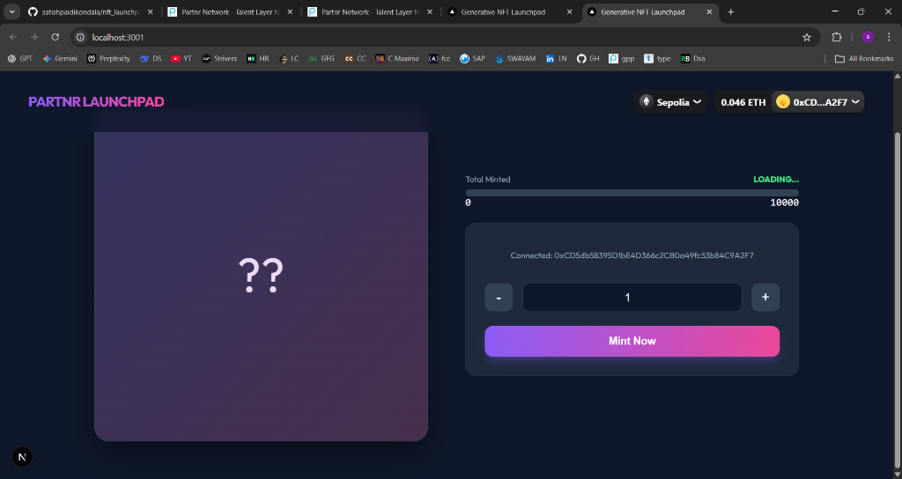

# Partnr Generative NFT Launchpad

A full-stack NFT launchpad solution featuring a gas-efficient Merkle Tree allowlist, IPFS metadata integration (reveal mechanism), and a premium Next.js DApp for minting. Built with Solidity, Hardhat, and Next.js.

## 🚀 Features

- **Smart Contract (ERC-721)**:
  - **Merkle Tree Allowlist**: Gas-optimized whitelist verification.
  - **Phased Minting**: Owner-controlled states (Paused, Allowlist, Public).
  - **Reveal Mechanism**: Switch from hidden to revealed metadata URIs.
  - **Withdrawal**: Secure owner withdrawal of funds.
- **Frontend DApp**:
  - **Modern UI**: Built with Next.js and Vanilla CSS (premium Partnr branding).
  - **Wallet Integration**: Seamless connection via RainbowKit & Wagmi.
  - **Real-time Data**: Live supply counts and sale status updates.
  - **Automatic Proofs**: Generates Merkle proofs in-browser for whitelisted users.
- **Infrastructure**:
  - **Dockerized**: specific `docker-compose` setup for consistent dev environment.
  - **Hardhat**: Local blockchain node for testing and development.

## 🖼️ Gallery

| Dashboard | Wallet Connection |
| :---: | :---: |
|  |  |

| Minting Interface |
| :---: |
|  |


## 🛠️ Tech Stack

- **Blockchain**: Solidity, Hardhat, OpenZeppelin
- **Frontend**: Next.js (App Router), RainbowKit, Wagmi, Viem
- **Storage**: IPFS (simulated/ready for Pinata)
- **Cryptography**: MerkleTree.js, Keccak256
- **Containerization**: Docker, Docker Compose

## 📋 Prerequisites

- Docker & Docker Compose
- Node.js (for local script execution if outside Docker)

## ⚙️ Setup & Installation

1.  **Clone the repository**:
    ```bash
    git clone <repository-url>
    cd nft_launchpad
    ```

2.  **Environment Configuration**:
    Copy `.env.example` to `.env` and fill in your details (optional for local dev, required for testnet).
    ```bash
    cp .env.example .env
    ```

3.  **Run with Docker**:
    Start the Hardhat Node and Frontend application.
    ```bash
    docker-compose up --build
    ```
    - **Frontend**: http://localhost:3000
    - **Hardhat Node**: http://localhost:8545

4.  **Deploy Smart Contract**:
    Once the containers are running, deploy the contract to the local node.
    ```bash
    # Run from your host machine (requires Node.js)
    npm install # if not installed locally
    npx hardhat run scripts/deploy.js --network localhost
    ```
    *Note: The frontend is pre-configured to look for the contract at the default deterministic address `0x5FbDB2315678afecb367f032d93F642f64180aa3`. If deployment results in a different address, update `frontend/app/page.js` or `NEXT_PUBLIC_CONTRACT_ADDRESS`.*

## 🧩 Usage

1.  **Connect Wallet**: Click the "Connect Wallet" button in the navbar.
2.  **Check Status**: View the current sale phase (Paused, Allowlist, Public).
3.  **Mint**:
    - **Allowlist**: If you are on the list (see `allowlist.json`), you can mint during the Allowlist phase.
    - **Public**: Anyone can mint during the Public phase.
4.  **Admin Actions** (Requires Owner Account `Account #0` from Hardhat):
    - Use Hardhat console or scripts to change sale state (`setSaleState`), reveal (`reveal`), or withdraw (`withdraw`).


## 🧪 Testing

Run the automated test suite for the smart contract:

```bash
npx hardhat test
```

## 📂 Project Structure

- `contracts/`: Solidity smart contracts.
- `frontend/`: Next.js DApp source code.
- `scripts/`: Deployment and definition scripts.
- `test/`: Hardhat unit tests.
- `docker-compose.yml`: Service orchestration.

---